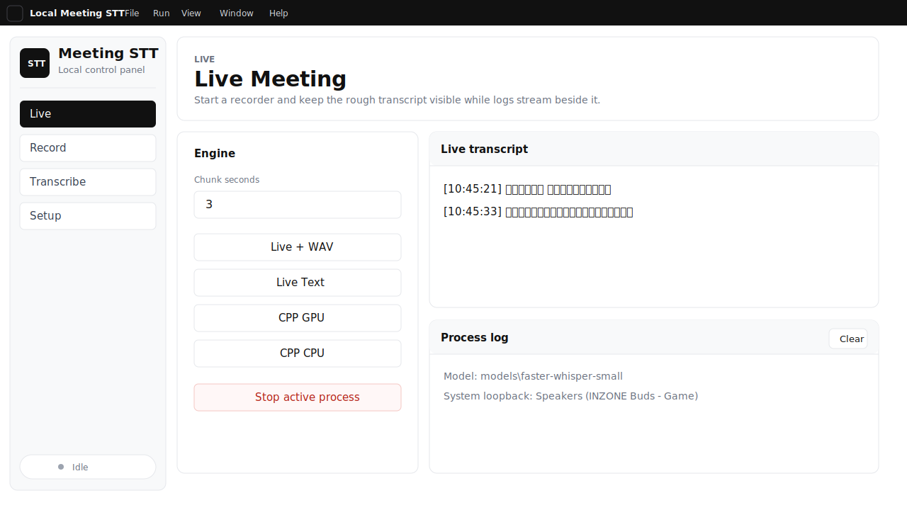

# Local Meeting STT

Windows desktop app for recording meeting audio and creating local transcripts.

The main target is Teams or browser meeting audio. The app records system audio through Windows loopback, can optionally mix your microphone, and can run either live rough transcription or post-meeting transcription.



## What You Can Do

- Record a meeting as a `.wav` file.
- Watch a rough live transcript while the meeting runs.
- Transcribe an existing audio file after the meeting.
- Use whisper.cpp CPU/GPU or Qwen3-ASR CPU/GPU from one UI.
- Keep recordings, logs, and transcripts local.

## Start The App

Requirements:

- Windows
- `uv`
- Node.js / npm

Run:

```powershell
cd electron_app
npm install
npm run dev
```

If this is the first time using the repo, open the `Setup` tab and click the download button to fetch local models and whisper.cpp runtimes.

## App Tabs

### Live

Use this during a meeting.

- `Live + WAV`: records audio and writes a rough live transcript.
- `Live Text`: rough live transcript only.
- `CPP GPU`: whisper.cpp live transcription with GPU build.
- `CPP CPU`: whisper.cpp live transcription with CPU build.

Lower `Chunk seconds` for lower delay. Higher values are usually more stable.

### Record

Use this when you only want a clean audio recording.

- `Until Enter`: record until you stop it.
- `Timed WAV`: record for the number of seconds shown.

### Transcribe

Use this after a meeting.

Drop or choose an audio file, then run:

- `CPP GPU` / `CPP CPU` for faster whisper.cpp transcription.
- `Qwen GPU` / `Qwen CPU` for Qwen3-ASR post-processing.

Qwen can be slower and use more VRAM, but it is useful to compare final transcript quality.

### Setup

Use this to prepare the local machine.

- Check whether models and whisper.cpp binaries exist.
- Download missing assets.
- Open recordings and whisper.cpp output folders.
- Choose the Windows speaker loopback device.
- Enable optional microphone mixing.

Blank audio device selection means the default device is used.

## Useful Controls

- `Ctrl+B`: collapse or expand the sidebar.
- `File > Open Audio...`: choose an audio file for post-transcription.
- `View > Clear Logs`: clear the process log and live transcript panel.
- `Help > GitHub Repository`: open the project repository.

## Output Folders

Live meeting output:

```text
recordings/
  live_meeting_YYYYMMDD_HHMMSS/
    audio.wav
    live_transcript.txt
```

Post-transcription output is written next to the selected audio file.

Test/demo files live in:

```text
test/
```

Local model files, recordings, generated transcripts, and Electron build/cache files are ignored by Git.

## Notes

- Default language is Japanese.
- Main capture source is system audio, suitable for Teams/browser meeting audio.
- Live transcript is for low-latency checking, not final quality.
- For cleaner final output, record first and run post-transcription after the meeting.

For backend commands, folder layout, and technical details, see [TECHNICAL.md](TECHNICAL.md).

## License

Apache-2.0. See [LICENSE](LICENSE).

## Support

If this project saves you time, please consider giving it a GitHub star. It helps other people find the repo.

[](https://www.star-history.com/#kuchris/local-meeting-stt&Date)
