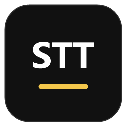

<p align="center">
  
</p>

# Local Meeting STT

Local-first Windows meeting transcription for Teams, browser meetings, and other
desktop audio.

The app captures Windows speaker/headset output through loopback, can optionally
mix your microphone, and keeps recordings/transcripts on your machine. It is built
as a practical control panel for local STT backends such as whisper.cpp,
faster-whisper, OpenVINO, Vulkan, and Qwen3-ASR.


## Why This Exists

Most speech-to-text demos capture only the microphone. Meeting audio is usually
coming from the speaker output, so this app focuses on Windows loopback capture:

```text
Teams/browser audio -> Windows speaker loopback -> local transcript + saved WAV
```

Use it if you want:

- Local/offline meeting transcription without uploading audio to a cloud service.
- Live captions from Windows speaker output, not only microphone input.
- A saved `.wav` file as the source of truth for post-meeting transcription.
- Hardware backend experiments on Windows: CPU, Vulkan, OpenVINO NPU/GPU, CUDA.
- Japanese-focused local STT testing, while still usable for other Whisper languages.

## Quick Start

Download the latest portable zip from:

```text
https://github.com/kuchris/local-meeting-stt/releases
```

Then:

1. Extract the zip.
2. Run `Local Meeting STT.exe`.
3. Open `Setup`.
4. Download or place the model files needed for your mode.
5. Choose your Windows speaker loopback device.
6. Start with `CPP Vulkan LB Base` in the `Live` tab.

For repo/dev use, double-click from the repo root:

```text
open_electron_app.cmd
```

If a packaged app exists, the launcher opens it. Otherwise it starts Electron in
development mode.

## Recommended Modes

Start simple:

```text
Live meeting:        CPP Vulkan LB Base
Better live quality: CPP Vulkan LB Small
Post transcription:  CPP NPU, CPP OV GPU, CPP Vulkan, or Qwen CPU/CUDA
```

Mode guide:

```text
CPP Vulkan LB Base   -> recommended live mode, low delay, speaker loopback
CPP Vulkan LB Small  -> live mode with better Whisper accuracy, more load
CPP Vulkan           -> resident whisper.cpp server with Vulkan backend
CPP OV NPU           -> resident whisper.cpp OpenVINO server on Intel NPU
CPP OV GPU           -> resident whisper.cpp OpenVINO server on Intel GPU
CPP CPU              -> whisper.cpp CPU mode
CPP GPU              -> whisper.cpp CUDA mode for NVIDIA systems
Live + WAV           -> faster-whisper live transcript plus saved WAV
Live Text            -> faster-whisper live transcript only
Qwen CPU/GPU         -> Qwen3-ASR post-transcription comparison path
```

Note: `Qwen GPU` currently means CUDA-style GPU acceleration. It is mainly for
NVIDIA systems, not Intel Vulkan.

## What Gets Saved

The app writes recordings and transcripts to one output folder. Default:

```text
outputs/
```

Normal live output:

```text
outputs/
  live_meeting_YYYYMMDD_HHMMSS/
    audio.wav
    live_transcript.txt
```

Vulkan loopback live output:

```text
outputs/
  loopback_stream_base_YYYYMMDD_HHMMSS/
    audio.wav
    live_transcript.txt
  loopback_stream_small_YYYYMMDD_HHMMSS/
    audio.wav
    live_transcript.txt
```

Post-transcription writes transcript files back into the selected session folder
when the selected audio is a session `audio.wav`.

## Portable Package

Build a folder-style portable package from the repo root:

```text
build_portable_folder.cmd
```

It creates:

```text
electron_app/dist/Local Meeting STT portable/
  Local Meeting STT.exe
  settings.json
  README.txt
  python_backend/
  whisper_cpp/
  models/
  outputs/
  runtime/
```

The portable folder includes backend scripts and local runtimes when available,
including:

```text
whisper_cpp/bin_vulkan/
whisper_cpp/bin_vulkan_loopback/
whisper_cpp/bin_openvino/
```

Model files are still local assets. Put or download them into:

```text
models/
whisper_cpp/models/
```

## Assets

You do not need every model or runtime for every mode.

```text
CPP Vulkan LB Base   -> bin_vulkan_loopback + ggml-base model
CPP Vulkan LB Small  -> bin_vulkan_loopback + ggml-small model
CPP Vulkan           -> bin_vulkan + ggml-base model
CPP OV NPU/GPU       -> bin_openvino + ggml-small model + OpenVINO encoder
CPP CPU              -> bin_cpu + ggml-small model
CPP GPU              -> bin_cuda + ggml-small model
Live Text / Live WAV -> faster-whisper small model
Qwen CPU/GPU         -> Qwen3-ASR model
```

The `Setup` tab shows asset status and has per-row download buttons where
downloading is supported. Vulkan and OpenVINO runtimes are local/release artifacts,
not normal model downloads.

## App Tabs

### Live

Use this during a meeting. The live panel shows a timestamped transcript and process
log. For most users, `CPP Vulkan LB Base` is the first mode to try.

### Record

Use this when you only want a clean audio recording.

- `Until Enter`: record until you stop it.
- `Timed WAV`: record for the selected duration.

### Transcribe

Use this after a meeting.

Drop or choose an audio file, then run one of:

- `CPP CPU`
- `CPP GPU`
- `CPP Vulkan`
- `CPP NPU`
- `CPP OV GPU`
- `Qwen CPU`
- `Qwen GPU`

The live transcript is for following the meeting. The saved WAV is the better input
for final post-transcription.

### Setup

Use this to prepare the local machine.

- Check whether models and local runtimes exist.
- Download supported missing assets.
- Choose and open the output folder.
- Choose the Windows speaker loopback device.
- Enable optional microphone mixing.

Blank audio device selection means the script default device is used.

## Developer Run

Requirements:

- Windows
- Node.js and npm
- `uv`

Run:

```powershell
cd electron_app
npm install
npm run dev
```

Build check:

```powershell
cd electron_app
npm run build
```

## Useful Controls

- `Ctrl+B`: collapse or expand the sidebar.
- `File > Open Audio...`: choose an audio file for post-transcription.
- `View > Clear Logs`: clear the process log and live transcript panel.
- `Help > GitHub Repository`: open the project repository.

## Notes

- Default language is Japanese.
- Main capture source is Windows system audio.
- Live transcript quality depends heavily on model size and hardware.
- For cleaner final output, record first and run post-transcription after the meeting.
- The custom Vulkan loopback build is documented under `whisper_cpp/`.

For backend commands, folder layout, and technical details, see
[TECHNICAL.md](TECHNICAL.md).

## License

Apache-2.0. See [LICENSE](LICENSE).

## Support

If this project saves you time, please give it a GitHub star. Stars help other
people find local-first Windows speech-to-text tools.

[](https://www.star-history.com/#kuchris/local-meeting-stt&Date)
