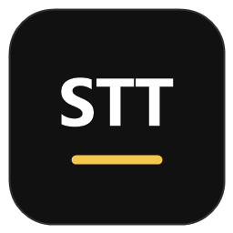
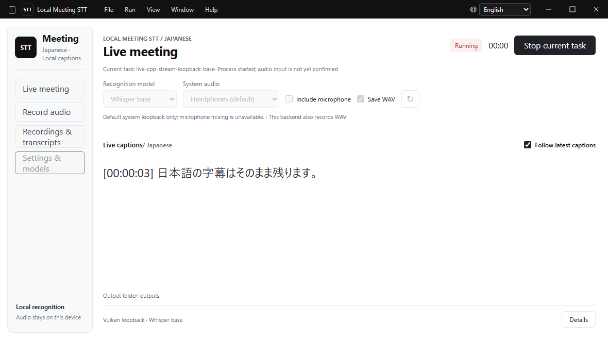

<p align="center">
  
</p>

# Local Meeting STT

[](https://github.com/kuchris/local-meeting-stt/releases/latest)
[](https://github.com/kuchris/local-meeting-stt/stargazers)
[](https://github.com/kuchris/local-meeting-stt/forks)
[](https://github.com/kuchris/local-meeting-stt/issues)
[](LICENSE)

**中文** · [English](README-EN.md) · [日本語](README-JA.md)

在 Windows 上執行的本機會議字幕、錄音及會後轉錄工具。透過喇叭／耳機的系統音訊回送（loopback），擷取 Teams、瀏覽器會議或其他桌面音訊，亦可混入麥克風。錄音與語音辨識均在你的電腦上處理。

**介面預設為英文。** 可在標題列切換繁體中文或日文，程式會記住你的選擇。介面語言與辨識語言互相獨立：目前提供的辨識流程使用日文。



*畫面中的字幕為測試文字，並非真實會議錄音。*

## 開始使用

從原始碼執行需要：

- Windows、Node.js/npm 及 [uv](https://docs.astral.sh/uv/)。
- 所選後端需要的本機模型與執行環境。
- CUDA 需要 NVIDIA GPU；其他後端各有硬體要求。

```powershell
cd electron_app
npm ci
npm run dev
```

1. 開啟 **Settings & models（設定與模型）**，檢查並下載所需檔案。
2. 在 **Live meeting（即時會議）** 選擇模型及系統音訊來源。
3. 如需收錄自己的聲音，啟用 **Include microphone** 並選擇麥克風。
4. 展開 **Details**，選擇後端及音訊分段長度。
5. 按下 **Start meeting** 開始；所有頁面均可使用 **Stop current task** 停止工作。

全新設定預設使用 faster-whisper，在 CPU 上執行 Whisper small。支援 NVIDIA CUDA 的電腦可在 Details 選擇 whisper.cpp CUDA 後端。Whisper base 透過現有的 Vulkan loopback 後端使用。

首次設定可能需要下載相依套件及模型。安裝後，辨識使用本機模型，不會呼叫雲端 ASR 服務。程序正在執行不代表已收到音訊，請查看字幕及程序日誌確認。

亦可下載 [portable 版本](https://github.com/kuchris/local-meeting-stt/releases)。已發佈的安裝包可能比目前原始碼舊。根目錄的 `open_electron_app.cmd` 會優先開啟現有的打包版本；如需執行目前 checkout 的程式碼，請使用上面的 `npm run dev`。

## 功能頁面

| 頁面 | 功能 |
| --- | --- |
| Live meeting | 大型即時字幕、模型及音訊控制、可選的 WAV 錄音，以及可收合的診斷資訊。 |
| Record audio | 錄音供稍後轉錄，可設定錄音時限。 |
| Recordings & transcripts | 選擇錄音或拖入音訊檔案，再選擇模型與後端。 |
| Settings & models | 檢查／下載所需檔案，並設定輸出資料夾。 |

即時字幕可選 **Whisper small** 或 **Whisper base**。會後轉錄可選 **Whisper small** 或 **Qwen3-ASR 0.6B**。Qwen 目前用於檔案轉錄，不支援即時字幕。

程式會儲存會後轉錄的後端選擇。在 Whisper 與 Qwen 之間切換時，會保留 CPU／CUDA 偏好。若未儲存轉錄偏好，而即時會議已使用 CUDA，轉錄亦會預選 CUDA；其他情況預選 CPU。明確儲存的 CPU 選擇不會被覆蓋。

## 後端與本機檔案

| 後端 | 本機檔案 | 備註 |
| --- | --- | --- |
| faster-whisper | `models/faster-whisper-small/` | 預設使用 CPU，支援即時字幕及可選的 WAV 錄音。 |
| whisper.cpp CPU | `whisper_cpp/bin_cpu/Release/` + `ggml-small.bin` | 即時伺服器及檔案轉錄。 |
| whisper.cpp CUDA | `whisper_cpp/bin_cuda/Release/` + `ggml-small.bin` | NVIDIA GPU，即時伺服器及檔案轉錄。 |
| whisper.cpp Vulkan | `whisper_cpp/bin_vulkan/Release/` + `ggml-small.bin` | 常駐即時伺服器及檔案轉錄。 |
| OpenVINO NPU/GPU | `whisper_cpp/bin_openvino/Release/` + small 模型及 encoder XML/BIN | 需要相容的 OpenVINO 裝置及本機建置。 |
| Vulkan loopback | `whisper_cpp/bin_vulkan_loopback/Release/` + base 或 small 模型 | 只使用系統預設音訊回送，不支援自訂裝置或麥克風混音。 |
| Qwen CPU/CUDA | `models/Qwen3-ASR-0.6B/` | 檔案轉錄，共用固定版本的 Python 執行環境。 |

`ggml-*.bin` 應放在 `whisper_cpp/models/`。即時 CPU／CUDA 後端同時需要 `whisper-server.exe` 及 `whisper-cli.exe`。檔案檢查只確認路徑存在，不會驗證硬體相容性或所有下載檔案的完整性。Vulkan 與 OpenVINO 執行檔來自本機建置或發佈包，並非一般模型下載的一部分。

## 延遲與停止行為

Whisper CPU／CUDA 即時會議會維持一個已載入模型的伺服器，避免每段音訊重新載入模型；會議結束時會釋放模型。

預設每段音訊為 3 秒，收集完整段落後才開始辨識。可在 Details 嘗試改為 2 秒，以加快更新，但句子上下文可能減少。faster-whisper 佇列只保留一段待處理音訊；辨識追不上時會略過舊的字幕片段，WAV 錄音則繼續。

Python 即時辨識／錄音工作最多有 10 秒停止擷取、關閉 WAV 並釋放模型程序。若未能退出，Electron 會終止整個程序樹。檔案轉錄及原生 loopback 工作採用強制終止。關閉應用程式時亦會等待清理。停止可能捨棄排隊中或未完整的字幕，亦可能中斷尚未完成的輸出；最終逐字稿請使用已儲存的錄音重新轉錄。

Qwen 啟動器共用 `python_backend/qwen-requirements.txt`，包含 PyTorch 2.11／CUDA 12.8，支援 RTX 5070 Ti 等相容的 NVIDIA GPU。CPU 選項使用相同執行環境，但在 CPU 上推論。載入模型權重前會測試 GPU 運算核心；缺少本機模型時會顯示明確錯誤。

詳見[後端診斷與實測](docs/backend-review.md)。公開音訊重播及原生 Electron 檢查已通過，但不能據此保證真實會議的辨識準確度或音訊擷取可靠性。

## 儲存檔案與操作

預設輸出到 `outputs/`。一般即時會議資料夾如下：

```text
outputs/
  live_meeting_YYYYMMDD_HHMMSS/
    audio.wav
    live_transcript.txt
```

資料夾前綴因後端而異。轉錄會議資料夾內的 `audio.wav` 時，逐字稿會寫回同一資料夾；其他匯入音訊的逐字稿則寫入設定的輸出資料夾。

- **Ctrl+O**：選擇要轉錄的音訊。
- **Ctrl+B**：收合／展開側邊欄。
- **View > Clear logs**：清除診斷日誌，保留字幕。
- **Details**：查看後端輸出，調整即時後端及音訊分段設定。

`settings.json` 儲存介面語言（`ui.locale`）、會後轉錄後端（`post.kind`）、擷取裝置、即時模式及輸出偏好。沿用設定檔升級時會保留語言選擇；語言設定缺失或無效時使用英文。原始後端日誌、裝置名稱、檔名及逐字稿內容不會翻譯。

## 建置與驗證

```powershell
cd electron_app
npm run build
```

請參閱 [Electron 開發與測試說明](electron_app/README.md)，了解 renderer 測試、三語版面檢查、原生設定／IPC 測試，以及後端生命週期與重播檢查。

在專案根目錄執行 `build_portable_folder.cmd` 可建立資料夾式 portable 版本。每次建置會建立新的 `electron_app/dist/release-VERSION-ID/`，包含 portable 資料夾、帶版本號的 ZIP 及 `SHA256SUMS.txt`。套件包含執行檔、後端腳本、全新英文設定，以及本機可用的 Vulkan／OpenVINO 執行檔；不包含模型、Python 環境、快取或錄音。CPU／CUDA 執行檔可在 Settings & models 下載。

從 [Releases](https://github.com/kuchris/local-meeting-stt/releases/latest) 下載後，將完整 ZIP 解壓到可寫入的資料夾，再執行 `Local Meeting STT.exe`；DLL 及資源資料夾必須保留在一起。請先安裝 [uv](https://docs.astral.sh/uv/getting-started/installation/) 並加入 PATH。打包版本不需要 Node.js/npm。首次使用需要網路下載 Python 相依套件及模型。升級時請解壓到另一個資料夾，再按需要複製模型及錄音。Windows 版本未經程式碼簽署。

命令列流程及後端目錄結構請參閱 [TECHNICAL.md](TECHNICAL.md)。

## ASR 實驗

獨立的[基準測試工具](benchmarks/README.md)用於比較日文辨識準確度及延遲，不會變更應用程式的模型選擇：

- [Whisper／Qwen 實測結果](docs/asr-benchmark/2026-09-22/REPORT.zh-TW.md)。
- [Nemotron 3.5 串流辨識後續測試](docs/asr-benchmark/2026-09-22-nemotron/REPORT.zh-TW.md)。

這些是小規模、乾淨語音的實驗，不代表真實會議品質保證。模型、下載的音訊、私人錄音、快取及執行環境均排除於 Git 之外。

## 授權

Apache-2.0。詳見 [LICENSE](LICENSE)。

## 支持專案

如果這個專案對你有幫助，歡迎在 GitHub 按 Star，讓更多人找到它。

[](https://www.star-history.com/#kuchris/local-meeting-stt&Date)
